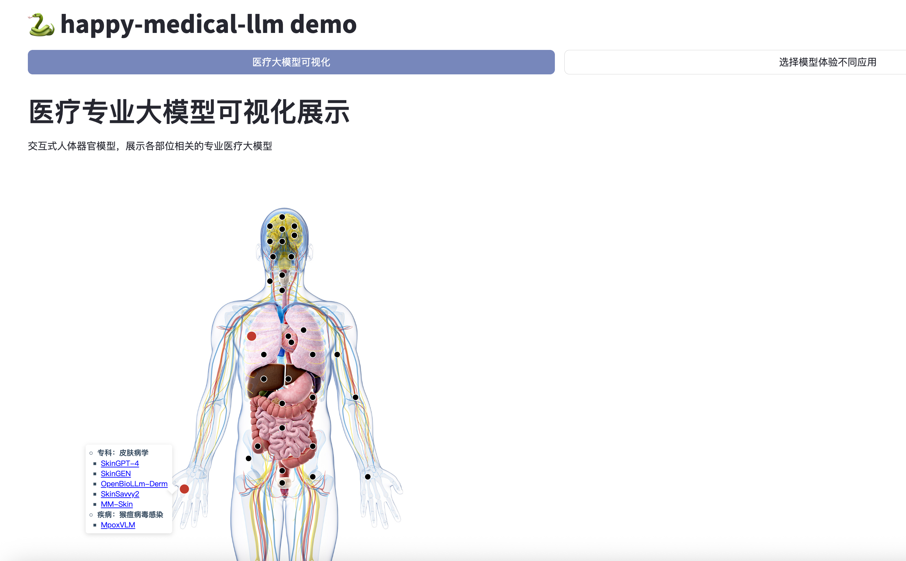
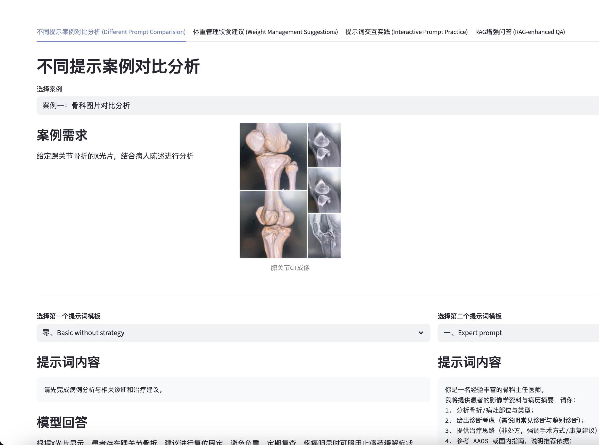

# HappyMedicalAI demo repo

| 引入页面               | 演示页面              |
| ---------------------- | --------------------- |
|  |  |

https://github.com/hibetterheyj/HappyMedicalAI/tree/master/demo

| 章节   | 案例主题                                  | 核心技术关键词     |
| ------ | ----------------------------------------- | ------------------ |
| 第二章 | 主流大模型：医疗辅助导诊与科普            | 提示词工程         |
| 第三章 | 通用医疗大模型：基于RAG的体重管理饮食建议 | 上下文工程         |
| 第四章 | 专业医疗大模型：口腔医学辅助诊断          | 模型微调、强化学习 |

## 快速使用

```bash
# 创建虚拟环境
conda create -n rag python=3.12
conda activate rag
pip install -r requirements.txt

# 拉取所需模型（本地Ollama部署）
ollama pull bge-m3:567m  # 嵌入模型
ollama pull deepseek-r1:1.5b  # 对话模型
ollama pull qwen2.5vl:3b
ollama pull qwen2.5vl:7b
ollama pull gemma3:4b
ollama pull gemma3:1b
ollama pull llama3.2:3b
ollama pull llama3.2:1b

# 启动应用
streamlit run app.py
```

## 模型配置

```yaml
# config.yaml样例
# API配置文件，区分不同提供商的chat模型和embedding模型
# 未来考虑支持rerank模型以及区分纯单一/多模态模型
ollama:
  base_url: "http://localhost:11434"
  chat_models:
    - name: "deepseek-r1:1.5b"
      default: true
  embedding_models:
    - name: "bge-m3:567m"
      default: true

qwen:
  api_key: "" # 请填写您的API密钥
  base_url: "https://dashscope.aliyuncs.com/compatible-mode/v1"
  chat_models:
    - name: "Qwen3-235B-A22B"
      default: true
    - name: "Qwen3-72B"
    - name: "Qwen2.5-VL-7B-Instruct"
    - name: "Qwen2-VL-72B"
  embedding_models:
    - name: "Qwen3-Embedding-8B"
      default: true
```

## 项目结构
- `assets/`：静态资源目录
  - `smed_interaction/`：医疗交互可视化资源
- `demos/`：各演示模块代码
- `core/`：核心功能模块（模型管理、知识处理）
- `app.py`：应用入口
