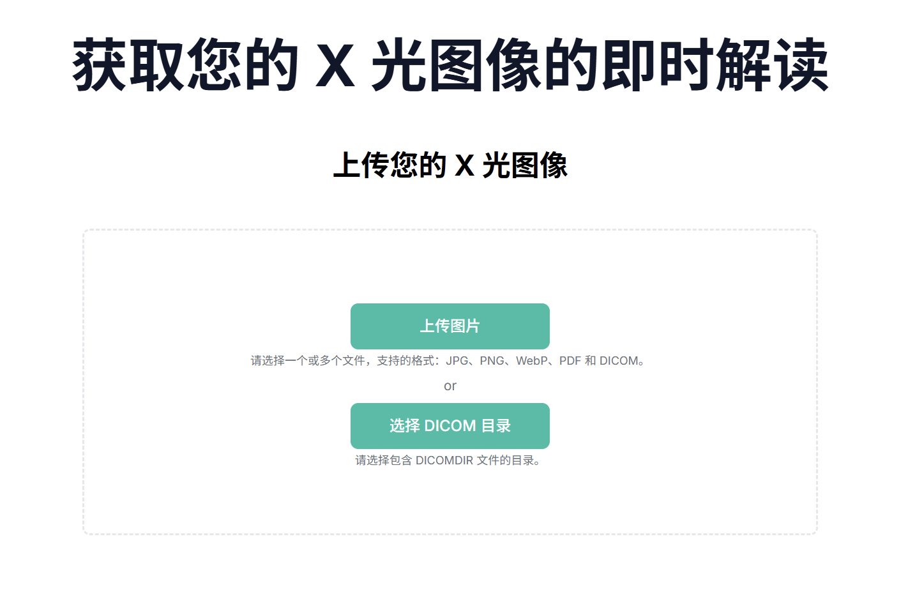
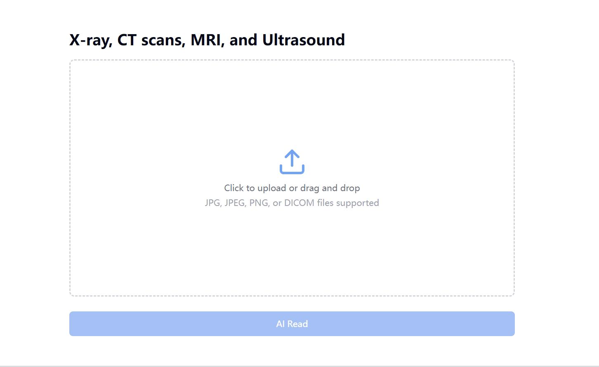
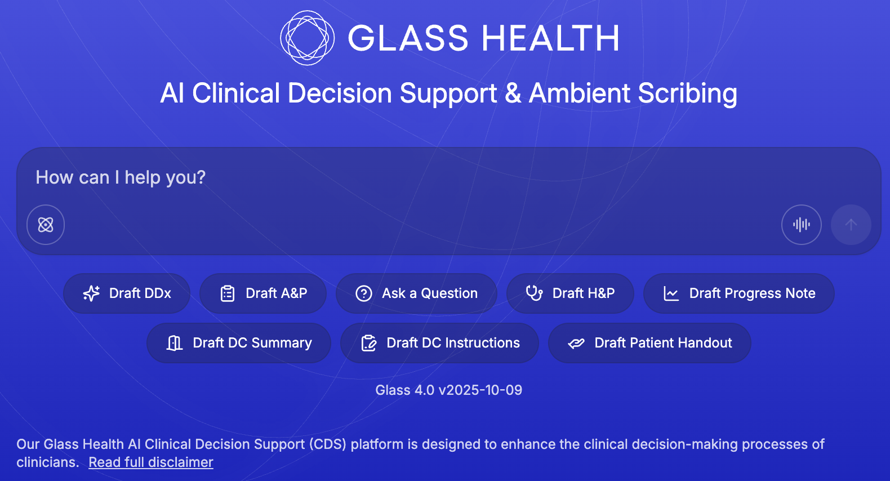
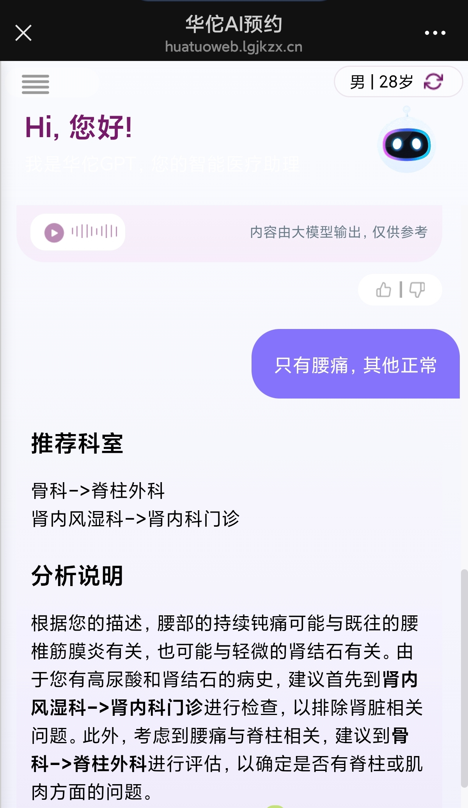
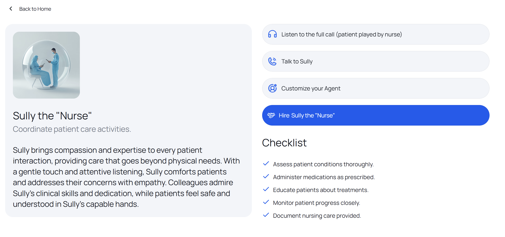
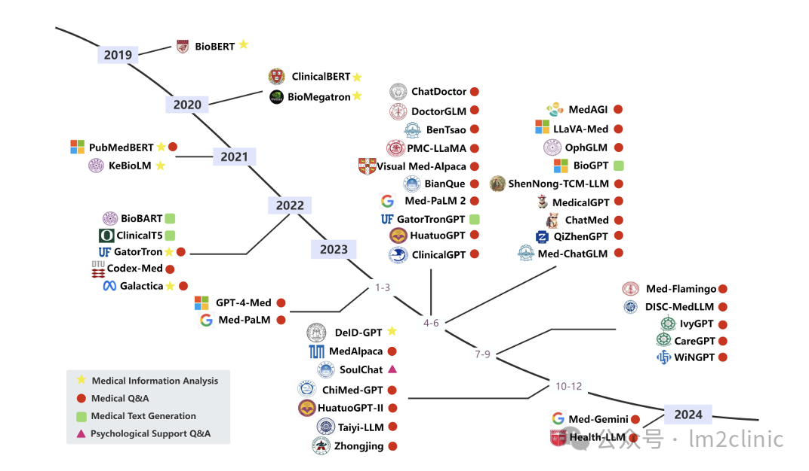
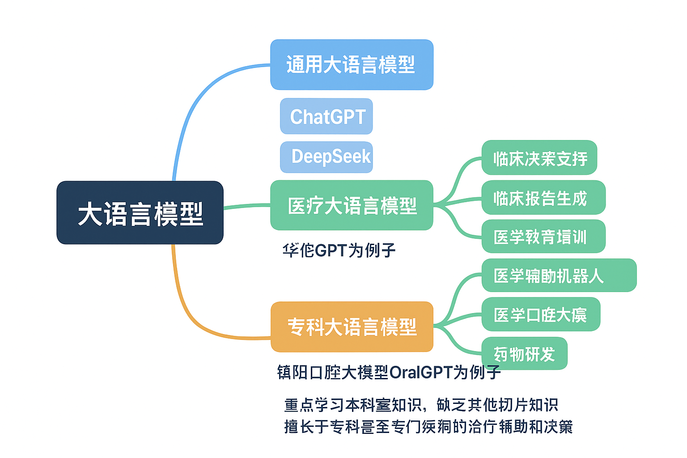

# 第一章 AI赋能医疗：应用概览与模型区分

## 1.1 AI赋能医疗历史

| 阶段       | 时间        | 技术特征                                | 代表性医疗应用与历史依据                                     | AI在临床中的角色定位                                         | 对医学思维的启示                                             |
| ---------- | ----------- | --------------------------------------- | ------------------------------------------------------------ | ------------------------------------------------------------ | ------------------------------------------------------------ |
| 探索期     | 1950s–1970s | 以规则推理和专家系统为主（Symbolic AI） | 🩺 MYCIN（1972, Stanford）基于规则的抗生素推荐系统；Internist-1（1970s, Univ. of Pittsburgh）用于内科诊断。 | 🔹 AI作为“知识检索与推理辅助工具”。🔹 需依赖医生提供完整病情与判断。 | 医学决策可形式化，但仍需医生的经验与临床语境判断。           |
| 技术积累期 | 1980s–1990s | 专家系统与统计模型结合，知识工程主导    | 🩺 CAD（Computer-Aided Diagnosis）早期影像判读系统；心电自动分析算法（GE、Philips设备内置）。 | 🔹 AI为“仪器层面的辅助模块”，提升检测效率。🔹 医生负责解释与决策。 | AI可提升信息处理速度，但不能独立完成诊断闭环。               |
| 数据驱动期 | 2000s–2010s | 机器学习与特征工程兴起；医学影像数字化  | 🩺 肺结节识别模型、乳腺X线AI筛查（NIH公开数据库支持）。🧬 基因数据AI分析用于癌症风险预测。 | 🔹 AI成为“分析助手”，协助医生从海量数据中提取特征。           | 数据可辅助发现规律，但临床意义仍需医生解读。                 |
| 深度学习期 | 2015–2020   | 卷积神经网络（CNN）驱动图像识别突破     | 🩺 IDx-DR（2018, FDA首批批准的AI诊断系统）可筛查糖尿病视网膜病变；DeepMind AI乳腺癌检测准确率与放射科医生相当。 | 🔹 AI成为“影像诊断辅助者”。🔹 强调“医生验证—AI支持—共同决策”模式。 | AI可在特定任务中表现优越，但临床解释与责任必须由医生承担。   |
| 智能融合期 | 2020–2025   | 多模态AI与医疗大语言模型（Med-LLM）崛起 | 🩺 Med-PaLM（Google, 2023）、华佗GPT、BioMind等多模态医疗模型；用于报告生成、决策辅助与教学。 | 🔹 AI成为“知识与推理的协作伙伴”。🔹 强调医生在AI建议基础上进行临床推理与伦理评估。 | 医生需掌握AI理解力（AI literacy），将AI结果纳入临床综合判断。 |
| 未来展望期 | 2025以后    | 生成式AI、数字孪生、实时决策支持        | 🩺 数字孪生病人模拟、个性化治疗预测模型。                     | 🔹 AI作为“认知放大器（Cognitive Augmentor）”，协助医生进行复杂多因素分析。🔹 医生仍是唯一具备临床判断与人文关怀能力的主体。 | AI强化医生的精准与效率，但人文判断与综合诊疗无法被替代。     |

## 1.2 具体实例介绍

#### 1.2.1 **医学影像分析**

AI可以分析医疗影像（如X射线、CT扫描和MRI），快速识别异常，提高诊断准确率和速度。例如，在癌症筛查中，AI能检测微小病变，帮助放射科医生减少漏诊。

| 案例                                                         | 示意图                                                       |
| ------------------------------------------------------------ | ------------------------------------------------------------ |
| [X rays.AI – 秒级放射影像的人工智能分析](https://xrays.ai/zh-CN) |  |
| [AI X-ray, CT scans, MRI, Ultrasound Analysis Tool - CT Read](https://ctread.com/#playground) |  |

#### 1.2.2 **智能问诊与分诊**

AI聊天机器人能处理患者咨询、预约和症状检查，减轻医护人员负担，提供24/7支持。

| 案例                                                         | 示意图                                                       |
| ------------------------------------------------------------ | ------------------------------------------------------------ |
| [Glass Health: AI Clinical Decision Support & Ambient Scribing](https://glass.health/) |  |
| [华佗预问诊HuotuoGPT](https://www.huatuogpt.cn/)             |  |

#### 1.2.3 医院管理助手

自动化行政任务，简化预约与患者筛查：

| 案例                                                         | 示意图                                                       |
| ------------------------------------------------------------ | ------------------------------------------------------------ |
| [Sully.ai - Superhuman team of AI Employees for Hospital](https://www.sully.ai/) |  |

## 1.3 三种大语言模型异同对比简述

**2019 - 2024 年医疗大型语言模型的演进来自[A Survey on Medical Large Language Models: Technology, Application, Trustworthiness, and Future Directions](https://arxiv.org/abs/2406.03712)**

通用大语言模型、医疗大语言模型、专科专病大语言模型-我们如何区分三种大语言模型呢？

首先，我们需要明白三种大语言模型从**来源分析，**有什么要素是区分三者的关键要素呢？训练的数据库是什么组成呢？

比如，一位医学生在学习全科知识以后，专精于某一专科学习，所以我们如何区分这位医学生和其他医学生未来的科室门类，取决于医学生学习什么课程知识和科室知识。大语言模型的学习来源是我们喂给AI学习的数据库，我们提供的数据很重要。

- **通用大语言模型**：各领域知识
- **医疗大语言模型**：各领域知识+着重突出专业医疗知识是关键
- **专科大语言模型**：科室医疗知识为主，少量其他知识-专病大语言模型：一类疾病的专业知识

学习的内容不一样，对应的功能也不一样，延申出的应用场景也不一样。

## 1.4 语言模型异同效果对比

我们对比了经过权重转化与合并的[中文LlaMA-7b](https://github.com/michael-wzhu/ChatMed/blob/main/src/chatmed_llama_peft/LlaMA-7b模型准备.md)，以及经过了[ChatMed_Consult_Dataset](https://huggingface.co/datasets/michaelwzhu/ChatMed_Consult_Dataset) 和LoRA微调的[ChatMed-Consult](https://huggingface.co/michaelwzhu/ChatMed-Consult)模型。下面是五个典型例子的对比。更多测试样例见[More test examples](https://github.com/michael-wzhu/ChatMed/blob/main/src/web_services/test_examples/ChatMed-Consult_test.json)

| 问诊问题                                                     | 中文LlaMA-7b                                                 | ChatMed-Consult                                              |
| ------------------------------------------------------------ | ------------------------------------------------------------ | ------------------------------------------------------------ |
| 天气温度越来越高，对于有宝宝的家庭来说，室内空调开到几度合适，以前我都是开二十七，那医生说开错了。 | "A. 二十七摄氏度；B. 三十二八摄氏度；C.三十六二十四摄氏度；D.四十一九摄氏度；E. 四十一九摄氏度。" | "在夏天的时候，为了保持良好的健康和舒适的环境，建议您将房间内的空气调节器调至26-28摄氏度左右即可。如果您想让婴儿更加舒服地睡觉，可以把室温降低1-2个台阶（比如从27升至22），这样可以让孩子更容易入睡并提高睡眠质量。同时，也要注意定期清洁空调过滤网以及避免过度使用空调等措施以保证室内通风良好、干燥清新。" |
| 这两天关节痛，昨天贴了膏药好一点。昨晚吹了一下风扇，今天早上起床都起不了，走不了路。 | "可能是风湿性关节炎引起的疼痛和僵硬症状。建议您去医院做进一步检查以确定诊断并制定治疗方案。" | 您的症状可能是风湿性疾病引起的疼痛和僵硬感。建议您尽快就医并接受专业的诊断治疗。在等待看医生的过程中，可以尝试以下措施缓解痛苦：保持休息、避免过度活动或剧烈运动；使用热敷或者冷敷来减轻肿胀和疼痛；按摩局部肌肉以促进血液循环等。同时请注意保暖，穿暖和的衣服，以免加重病情。" |
| 癫痫病25年了，这些年病情一直都比较稳定，发作次数也很少，现在开始频繁发作了该怎么办？有没有什么针对的办法可以解决啊？ | 建议您及时就医并进行检查。如果确诊为癫痫持续状态（EPS）或阵发性间歇期发作等需要药物治疗的情况，可以考虑使用抗惊厥药、镇静催眠剂和神经营养素类药物来控制症状；同时注意饮食卫生及生活习惯的调整也是很重要的。 | "如果您的癫痫症状越来越多、更频繁或更加严重，建议您尽快就医。以下是一些可能有助于缓解您的情况的方法和注意事项:\n\n1.保持规律的生活方式，包括充足睡眠时间、饮食健康等；\n2.避免过度疲劳或者精神紧张的情况发生；\n3.定期进行体检和其他必要的检查以确保身体健康状况良好；\n4.遵从医生开具的药物治疗方案并按时服药；\n5.在紧急情况下及时拨打急救电话寻求帮助。\n\n请注意，以上方法只是一般性的指导原则，具体治疗方法需要根据个人实际情况而定，最好咨询专业医师的意见。" |
| 上牙床外凸，牙齿还是较整齐的，微笑时会露出很大的牙床，已经21岁了，带牙套会有用吗，需要带多久，多少钱啊。 | "建议您去口腔医院进行检查和治疗，因为这属于比较严重的问题之一。" | "如果您想矫正您的下颌骨和牙齿问题，可以考虑戴牙套来达到这个目的。但是需要注意的是，佩戴牙套的时间长短取决于问题的严重程度以及个人的情况。一般来说，如果情况比较轻微或不影响日常生活的话，可能只需要几个月就可以看到明显的效果；但如果情况较为复杂或者影响到生活质量，可能会更长时间才能完成治疗过程。此外，价格也会因地区、医院等因素而有所不同，建议您咨询当地口腔医生进行详细了解并制定个性化方案。" |
| 医生您好，我想给爷爷奶奶在美国买保健品/药，奶奶有长期冠心病，爷爷有缺血性心脏病，以前还做过白内障手术，请问有哪些药适合买?我看到的有鱼油，欧米茄（omega）3-6-9,还有烟酸，叶黄素，亚麻油. | 建议购买含有硝酸甘油、维生素E和钙片等成分的产品。            | "很抱歉听到您的家人健康问题。对于老年人来说，选择合适的药物非常重要。以下是一些可能有用的产品和建议供参考:\n\n1. Omega-3脂肪酸补充剂 - 这些产品通常含有丰富的Omega-3脂肪酸和其他营养成分，可以帮助降低血液中的胆固醇水平并预防心血管疾病。但是请注意，如果您正在服用其他抗凝或降脂药物，最好先咨询专业医师的意见是否需要调整剂量或者停止使用这些药品。\n\n2. Smart Heart Plus – 这是一种针对心脏问题的复合物，包括多种天然植物提取物、维生素B群等物质，能够改善血液循环、增强心肌功能以及保护血管壁等等。不过需要注意的是，这种产品的效果因人而异，所以在购买前一定要仔细阅读说明书并且遵循医嘱进行用药。\n\n3. CoQ10 - 这种辅酶是一种重要的能量代谢产物，它可以在细胞中提供电子流来支持ATP合成过程。CoQ10缺乏可能会导致疲劳感、肌肉疼痛等问题。因此，如果老人的身体状况允许，可以考虑添加适量的CoQ10以提高身体机能。" |

我们可以看到：

- 在线问诊，由于用户输入错字或者语音转文字带来噪音，问诊问题可能不会很规整。在这种情况下，中文LlaMA-7b模型可能会产生没有意义的回答。而ChatMed-Consult可以有效的从干扰中理解用户问题，做出相应的回答；
- ChatMed-Consult的回答会更加具有人性关怀一些，而中文LlaMA-7b模型的回复可能会比较生硬；
- ChatMed-Consult相较于中文LlaMA-7b模型的回答会更加丰富，具有更多可行的建议。
- 大模型作为医生的辅助，其可以多列举可能性和建议，但是不能太过武断的下结论。中文LlaMA-7b模型面对问诊问题会比较容易下直接下结论，似乎是有一些过度自信。ChatMed-Consult一般会说"以下是一些可能..."，相对更加谨慎。

## 小结

学习本项目，我们可以更好地应用AI于医疗场景中，帮助临床医生更好地了解医疗指南，快速获取影像病灶信息，帮助书写文案病例、帮助医学科研高效筛选论文等资料。

我们强调**人工智能AI只是医疗工作者的辅助者**，**无法替代临床医生和临床思维**，本项目更好地帮助医生提升AI使用效率和掌握医疗场景应用技术，提供医学生、规培生的医疗教学辅助，**而并非代替医生临床思考过程，AI更多承担辅助性角色**
