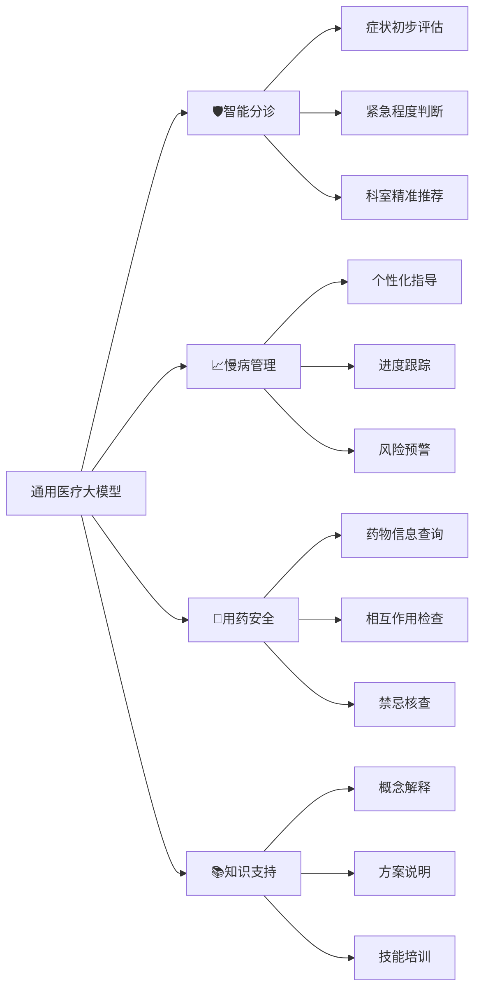
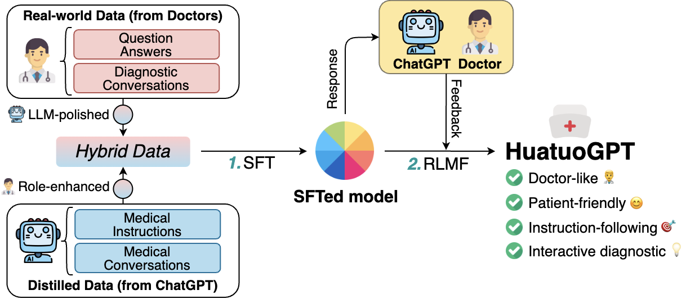
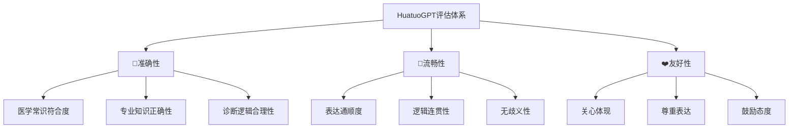
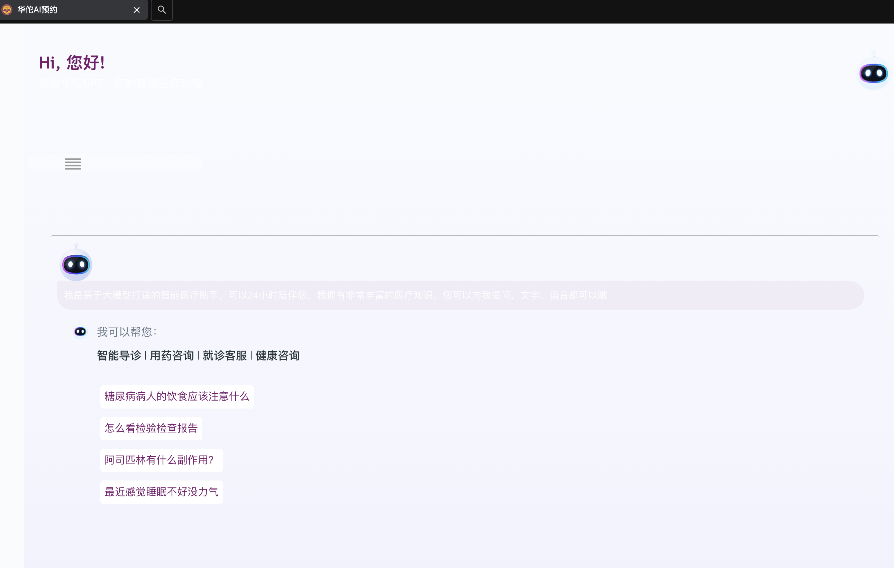
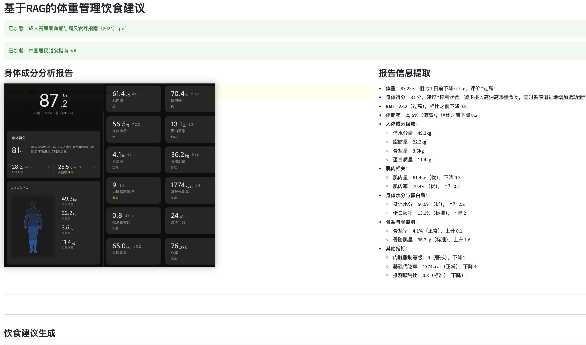

# 第三章 通用医疗大模型：全能医疗助手的功能与实践

通用医疗大模型就更像是医生身边的“全能助手”。它们基于强大的通用人工智能模型，通过海量医学专业知识进一步训练，具备了专业的医疗问答、诊断辅助和报告生成能力，成为医生日常工作的得力帮手。

## 3.1 通用医疗大模型及其应用

这些模型通常基于其强大的通用大模型，使用海量医学专业知识进行微调或继续预训练，以具备专业的医疗问答、诊断辅助和报告生成能力。

- **谷歌 - Med-PaLM 2**
  - **参考：** [官方技术博客](https://health.google/caregivers/health-ai/), 论文《Med-PaLM: Towards Expert-Level Medical Question Answering with Large Language Models》
  - **特点：**
    - 基于 PaLM 2 专门训练，医学问答基准首达 “专家” 水平。
    - 以医学题库、文献、医疗问答数据为基础，聚焦安全准确回答医学问题。
- **OpenAI - GPT-5**
  - **参考：** [OpenAI 官网](https://openai.com/product/gpt-4)
  - **特点：**
    - 通用模型，强推理与广知识支撑医疗咨询、信息提取。
    - 借 API 与插件生态，结合临床数据可开发智能分诊、病历摘要。
- **百川智能 - Baichuan M2**
  - **参考：** [开源代码](https://github.com/baichuan-inc/Baichuan-M2-32B), [官方技术报告](https://github.com/baichuan-inc/baichuan-med)
  - **特点：**
    - 基于基座，靠大型验证器系统、医疗中期训练、多阶段 RL 三大核心创新，实现医疗效果突破。
    - 为全球最强医疗开源模型（HealthBench 超开源及部分闭源模型），兼具医生思维对齐与通专兼顾能力。
- **京东健康 - 京东卓医（JOY DOC）**
  - **参考：** [京东健康数智医疗大会](https://cont.jd.com/content/14641189)
  - **特点：**
    - 医院全场景大模型，依托 “京医千询” 底座，覆盖患者、医生、医院管理场景。
    - 含三大模块：AiP 解决患者就医痛点，AiD 提升医生效率（提升病历解读效率等），AiH 优化医院运营。
- **腾讯健康 - 腾讯觅影・数智医生大模型**
  - **参考：** [腾讯健康医疗页面](https://healthcare.tencent.com/production/5)
  - **特点：**
    - 依托腾讯觅影技术积累，聚焦临床诊疗辅助与大众健康管理。
    - 支持病历结构化分析、疾病风险预警，适配国内医疗机构流程。

从上面的案例中，我们可以看到当前医疗大模型发展的两个主要方向：

- **追求极致医疗专业与可信**：以百川M2 Plus和谷歌MedLM为代表，它们非常注重模型的循证医学能力和专业知识的准确性，力求在严肃的临床场景中达到“专家”水平，成为医生可靠的助手。
- **融入服务生态与场景**：以腾讯、京东等国内互联网公司为代表，它们更侧重于将AI能力嵌入到现有的医疗健康服务流程中。

## 3.2 通用医疗大模型能解决哪些医疗问题？

通用医疗大模型就像是医学领域的"全科医生"，它们通过海量医学文献和临床数据的训练，具备了基础的医学知识和推理能力，能够在多个层面辅助医疗工作：

### 智能导诊与分诊

**真实场景想象**：深夜，一位患者在线描述“突发胸痛、呼吸困难”，通用大模型能够立即识别出可能的紧急情况，建议立即前往急诊，并提示需要排查心脑血管问题。这就像是有一位经验丰富的分诊护士，始终在第一时间为患者提供专业指导。

**对医生的价值**：

- 减轻初诊压力，让医生专注于更需要专业判断的病例
- 提供标准化的症状评估，减少因患者描述不清导致的误判
- 急诊分流，确保急重症患者得到优先处理

### 慢性病健康管理

- **典型应用**：对于高血压、糖尿病等慢性病患者，大模型可以：
  - 提供个性化的饮食、运动建议
  - 提醒用药时间和注意事项
  - 跟踪记录健康指标变化趋势
  - 在发现异常时及时提醒医患双方

**对医生的价值**：将医生从繁琐的日常随访中解放出来，让医生能够更专注于治疗方案的制定和调整。

### 用药安全与指导

当医生开具处方时，有一个智能助手能够实时提供：

- 药物相互作用检查
- 剂量合理性评估
- 患者过敏史匹配
- 特殊人群用药注意事项

这就像是有一位专业的临床药师随时在身边提供咨询，大大提升了用药安全性。

### 医疗知识问答

无论是需要快速查阅某个疾病的最新治疗指南，还是了解某种罕见病的临床表现，通用医疗大模型都能提供及时、准确的信息支持，成为医生持续学习和临床决策的得力助手：

- **医学概念解释**：用通俗语言解释专业医学术语
- **治疗方案说明**：详细解释各种治疗方法的原理和预期效果



## 3.3 参考案例：华佗GPT



*图 华佗GPT训练方法演示*

> [**开源代码**](https://github.com/FreedomIntelligence/HuatuoGPT)、[**官网演示**](https://www.huatuogpt.cn/#/)

由港中文FreedomAI团队开发的华佗GPT基于广泛高质量中文医学语料库训练；具备强生成与理解能力；通过准确性、流畅性、友好性全面评估，可辅助缓解基础症状。

- **核心创新：双轨训练策略**--通过强化学习技术，华佗GPT成功融合了这两种优势：既能像经验丰富的医生那样进行专业诊断，又能以清晰易懂的方式与患者沟通。

  - **向ChatGPT学习沟通艺术**：从ChatGPT蒸馏的数据让模型学会了详细阐述、友好表达和结构化回复，如同一位耐心的医学教师

  - **向真实医生学习诊断思维**：来自实际医患对话的数据让模型掌握了医生的专业诊断逻辑和问询技巧

- **技术架构与数据特色**

  - **四维数据体系**：

    - ChatGPT生成的指导性数据 → 培养指令遵循能力

    - 真实医生的指导性数据 → 注入专业医学知识

    - 真实患者的咨询数据 → 理解患者表达习惯

    - 真实医生的咨询数据 → 学习诊断交互模式

  - **模型规格**：

    - HuatuoGPT-7B：基于百川-7B训练，适合基础医疗场景

    - HuatuoGPT-13B：基于LLaMA-13B训练，具备更强的推理能力

## 评估体系与临床应用

HuatuoGPT建立了三维评估标准：



**实际部署成效**

目前华佗GPT已在深圳龙岗人民医院[**线下部署**](https://huatuoweb.lgjkzx.cn/?thirdPartyIdentification=lgrmyy-gzh&canToggle=0&userId=oc9ynjjRHkfQvIaNG29IioGRyTuo&unionId=&fromcode=2&code=051V5DFa161zyK0E6vGa1Dfl6E3V5DFr)，在实际应用中表现出色：

- **辅助初级分诊**：帮助患者初步判断症状严重程度
- **提供就医指导**：根据症状推荐合适的就诊科室
- **解答基础疑问**：回应患者关于常见疾病的咨询
- **缓解就医焦虑**：通过友好沟通减轻患者心理负担



*图 华佗GPT使用页面演示*

## 3.4 演示案例：基于RAG的体重管理饮食建议

## 概述

本助手能够智能解析用户的身体成分报告，结合权威膳食指南，生成个性化的饮食管理方案。它特别适合帮助医生快速为超重或肥胖患者制定科学的饮食干预计划。

**核心功能模块**

1. 智能文档管理：权威指南即时调用

   - **自动加载**：系统自动识别并加载《成人高尿酸血症与痛风食养指南》《中国居民膳食指南》等权威文档

   - **知识整合**：将分散的膳食知识构建成可检索的知识库，确保建议的专业性和准确性

   - **更新提醒**：自动检测文档完整性，缺失文件时及时提示补充

2. 身体成分智能解析：数据可视化呈现；临床价值：

   - 快速识别患者核心健康风险（如内脏脂肪等级9→警戒状态）

   - 跟踪短期变化趋势，评估干预措施效果

   - 为个性化建议提供精准数据支撑

3. 个性化饮食建议生成：RAG技术赋能
   1. **智能提示构建**：自动将体测数据转化为专业的医学查询
   2. **知识检索**：从膳食指南中精准匹配相关条款
   3. **建议生成**：结合患者具体情况输出可执行方案

**对医生的价值**：

- 节省查阅膳食指南的时间，快速产出个性化方案
- 确保建议的权威性和一致性，避免个人经验偏差
- 为患者提供详尽的书面指导，增强依从性

**可视化页面及案例**



- deepseek生成建议：

  ```
  ### 个性化饮食建议：
  
  #### 每日饮食的总体原则：
  
  1. **营养均衡**：根据身体成分分析报告，整体膳食应注重营养均衡，兼顾蛋白质、碳水化合物和脂肪的合理分配。
  2. **低脂肪摄入**：内脏脂肪等级较高（警戒级别），需避免高脂饮食，尤其是肝脏和肌肉。
  3. **控制热量消耗**：每日总能量建议为1650～1720kcal，以确保体重在“过高”范围内，避免过重。
  
  #### 推荐的食物种类及摄入量：
  
  根据膳食指南，推荐如下食物（可根据实际营养需求调整）：
  
  | 食品名称       | 入口量建议（g）                                     |
  | -------------- | --------------------------------------------------- |
  | 豆制品         | 10                                                  |
  | 背σ面包        | 10                                                  |
  | 优质蛋白粉     | 5                                                   |
  | 健全蔬菜       | 高层蔬菜如西葫芦、胡萝卜等，水果如香蕉、菠菜等各15g |
  | 牛肉（鱼类）   | 30g (鸡胸肉或鱼)                                    |
  | 糖分来源       | 低热量糖粉（3g/天）                                 |
  | 背σ牛奶        | 20ml（可选用可口可乐）                              |
  | 面粉（全麦面） | 15g                                                 |
  
  #### 应避免或限制的食物：
  
  - **高脂肪食物**：坚果、奶酪、巧克力、油炸食品（如鱼、肉）、硬饮料（含糖分和热量）
  - **高热量食物**：乳制品、奶酪、巧克力
  - **盐的添加**：可选择低盐或不含盐食物，如面包、蔬菜等。
  
  #### 其他有助于体重管理的饮食建议：
  
  1. **蛋白质来源优先**：根据膳食指南中提到的蛋白质比例，推荐鱼类（如鱼）和豆制品。
  2. **碳水化合物控制**：避免高热量碳水化合物，选择全谷物或可食用的杂粮类。
  3. **避免油炸食品**：减少油炸食品的摄入，建议少食油炸鱼、肉等。
  4. **饮食多样化**：根据天数调整食物种类，确保营养均衡。
  
  通过以上原则和推荐，用户应能有效管理体重，保持健康的生活方式。
  ```

## 3.5 演示案例2：医疗大模型之于中文专业考试问答

> **:warning: 需要询问相关HuatuoGPT API，并且增加演示**
