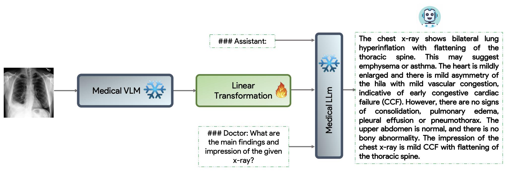
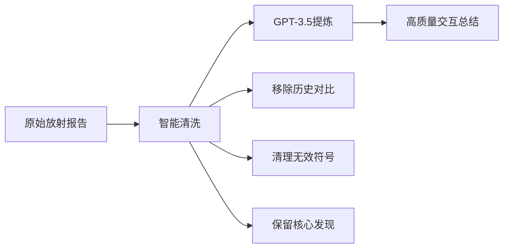
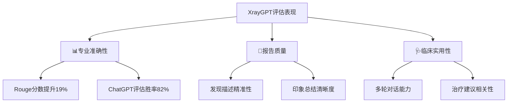
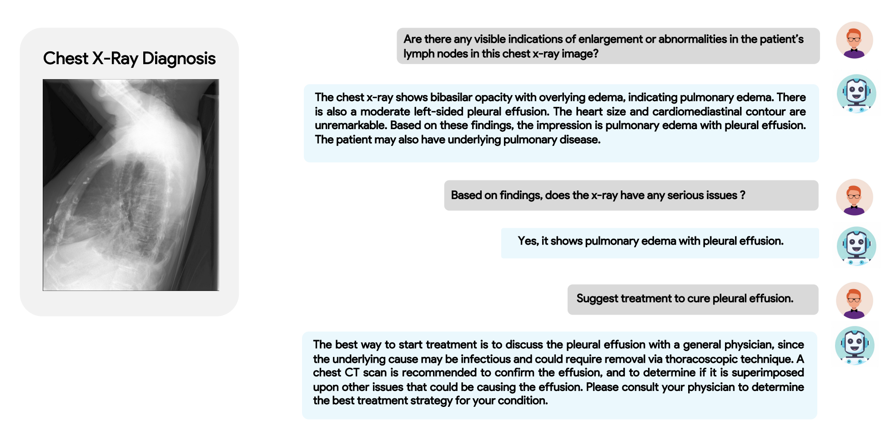

# 第四章 专科医疗大模型：专科诊疗的智能辅助

## 4.1 专科医疗大模型及其应用

> :warning: 插入交互动图

专科医疗大模型就像是“数字专科医生”，它们经过特定领域的深度训练，能够辅助医生完成从诊断、治疗到患者管理的多种任务。下面我们通过几个典型专科的案例，来看看这些模型是如何在实际中发挥作用的。

### 1. 肿瘤科：精准诊疗与个性化方案

- **OncoGPT**：就像一个肿瘤科助理，能基于海量临床对话数据，为患者提供个性化的治疗建议和病情解释。
- **CancerLLM**：像一个肿瘤知识库，能从电子病历和病理报告中自动提取癌症表型，辅助医生快速生成诊断报告。
- **MUSK**：如同“病理+影像”双料专家，能同时分析病理图像和临床文本，预测癌症类型和生物标志物。

### 2. 精神心理科：情绪识别与对话干预

- **Psy-LLM**：像一位“数字心理医生”，能识别用户情绪状态，提供专业的心理问答和危机筛查。
- **MentaLLaMA**：如同社交媒体情绪雷达，能从用户发帖中检测抑郁、焦虑等心理状态，并给出初步解释。
- **CBT-LLM**：基于认知行为疗法，能与患者进行结构化对话，帮助其调整负面思维模式。

### 3. 神经科：疾病预测与康复支持

- **Neura**：如同“神经科会诊系统”，能结合患者症状和医学知识库，生成鉴别诊断与证据来源。
- **AD-GPT**：专注于阿尔茨海默病，能分析患者基因数据和临床记录，辅助医生进行早期风险预测。
- **AutoHealth**：像一位“帕金森管家”，能通过穿戴设备数据监测患者运动状态，并提供个性化管理建议。

### 4. 眼科：影像解读与患者教育

- **OphGLM**：如同“眼底图像解说员”，能解读眼底照片并回答医生或患者提出的问题。
- **EyeCLIP**：像一位“眼科多面手”，不仅能分类眼病，还能预测全身性疾病（如糖尿病）在眼部的表现。
- **RetinaVLM**：专注于黄斑变性，能根据OCT图像自动生成临床报告和转诊建议。

### 5. 皮肤科：图像诊断与患者自助

- **SkinGPT-4**：像一台“皮肤科智能镜”，能根据患者上传的皮损照片自动诊断并推荐治疗方案。
- **MM-Skin**：支持多模态输入，能结合图像和文本描述，提高对罕见皮肤病的识别准确率。
- **SkinGEN**：不仅能诊断，还能生成皮损的模拟图像，帮助患者理解病情变化。

### 6. 放射科：报告生成与影像分析

- **Radiology-GPT**：像一位“放射科写手”，能根据影像所见自动生成规范的诊断报告。
- **ChatRadio-Valuer**：支持多模态交互，医生可以针对影像提出问题，模型能定位病灶并解释影像特征。
- **CXR-CLIP**：专注于胸片分析，能实现零样本疾病分类和影像-文本跨模态检索。

### 7. 传统中医：辨证论治与方剂推荐

- **TCM-GPT**：如同“中医典籍智能检索系统”，能回答中医理论问题并辅助辨证。
- **Zhongjing**：像一位“数字中医师”，能进行多轮问诊，根据症状推荐经方和药材。
- **LingdanLLM**：专注于中成药知识，能根据患者症状推荐合适的成药组合。

这些专科大模型并不是要取代医生，而是作为医生的“智能副手”，帮助处理重复性高、耗时长的任务，让医生能更专注于复杂的临床决策和患者沟通。随着技术的不断迭代，它们的应用场景还将进一步拓展。

## 4.2 参考案例：Xray-GPT--专注胸片的医学多模态对话助手

*图 XrayGPT模型架构示意图*

> [**开源代码**](https://github.com/mbzuai-oryx/XrayGPT)、[**官网演示**](https://xrayinterpreter.com/)

XrayGPT是由MBZUAI团队开发的**专注于胸部X光片分析的多模态医学对话模型**。它巧妙地将医学视觉理解与大语言模型相结合，能够像放射科医生一样"看懂"胸片并生成专业报告，同时支持用户针对图像内容进行深入对话询问。

## 核心创新：视觉与语言的医学对齐

XrayGPT的核心突破在于成功**将医学图像特征与专业文本描述精准对齐**，实现了真正的"看懂片子会说病情"：

- **专科化视觉编码**：采用专门训练的医学视觉编码器MedClip，能精准识别胸片中的肺炎、胸腔积液等细微病变

- **医学语言专家**：基于Vicuna大模型进行医学领域微调，学习了10万真实医患对话和2万放射科对话

- **简单有效的桥梁**：仅通过一个线性变换层，就将图像特征转化为语言模型能理解的"视觉词汇"

## 技术架构与数据特色

### 双阶段训练策略

- **第一阶段：广度学习**
  - 使用MIMIC-CXR数据集的21万张图像-文本对
  - 让模型建立X光图像与放射报告的基础关联

- **第二阶段：精炼优化**
  - 使用OpenI数据集的3000份高质量总结
  - 提升模型生成专业、精准放射报告的能力

### 高质量数据生成

通过智能清洗和GPT-3.5辅助，从原始放射报告中提炼出21.7万份**交互式高质量总结**：

**数据优化示例**：

- **原始发现**："与既往胸片对比，新发现胸椎压缩性骨折..."
- **优化总结**："胸片显示新发胸椎压缩性骨折，无胸腔积液或气胸..."

## 评估体系与专业价值

### 三维性能评估

### 实际应用场景

XrayGPT在胸片解读中展现出强大能力：

- **智能报告生成**：自动生成包含主要发现和总体印象的放射报告
- **交互式问询**：支持针对特定病变的深入询问，如"是否有肺水肿迹象？"
- **治疗建议参考**：基于影像发现提供初步治疗方向建议
- **教学辅助工具**：帮助医学生理解胸片表现与临床意义的关系

诊断案例：

*图 XrayGPT胸片诊断示意图，对话如下所示*

> 用户：这张胸片中患者的淋巴结是否有明显的肿大或异常迹象？
>
> XrayGPT：胸片显示双肺基底部致密影伴渗出，提示肺水肿。同时存在中度左侧胸腔积液。心脏大小和心胸轮廓无明显异常。基于这些发现，印象为肺水肿伴胸腔积液。患者可能还存在潜在的肺部疾病。
>
> 用户：基于这些发现，这张胸片有严重问题吗？
>
> XrayGPT：是的，显示肺水肿伴胸腔积液。
>
> 用户：建议如何治疗胸腔积液？
>
> XrayGPT：最佳的治疗起始方式是就胸腔积液咨询全科医生，因为其潜在病因可能是感染性的，可能需要通过胸腔镜技术引流。建议进行胸部 CT 扫描以确认积液情况，并确定是否合并其他可能导致积液的问题。请咨询您的医生以确定针对您病情的最佳治疗方案。

## 4.3 实践案例：专业牙科大模型OralGPT

> :warning: OralGPT/DentalGPT，镇阳
