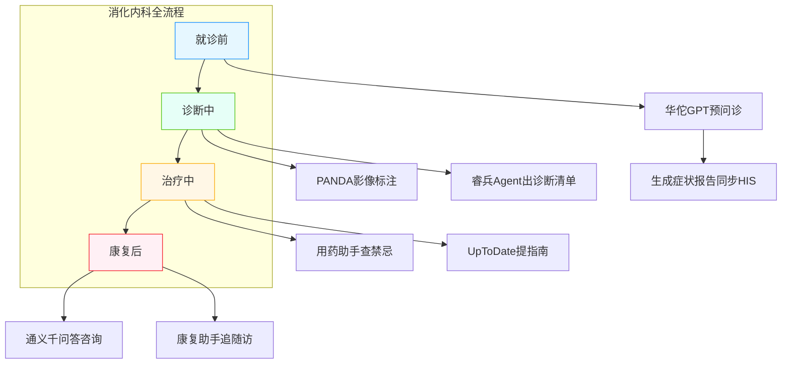
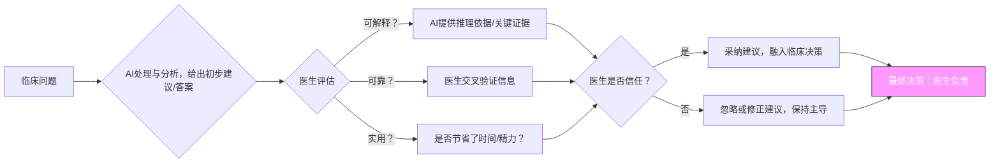
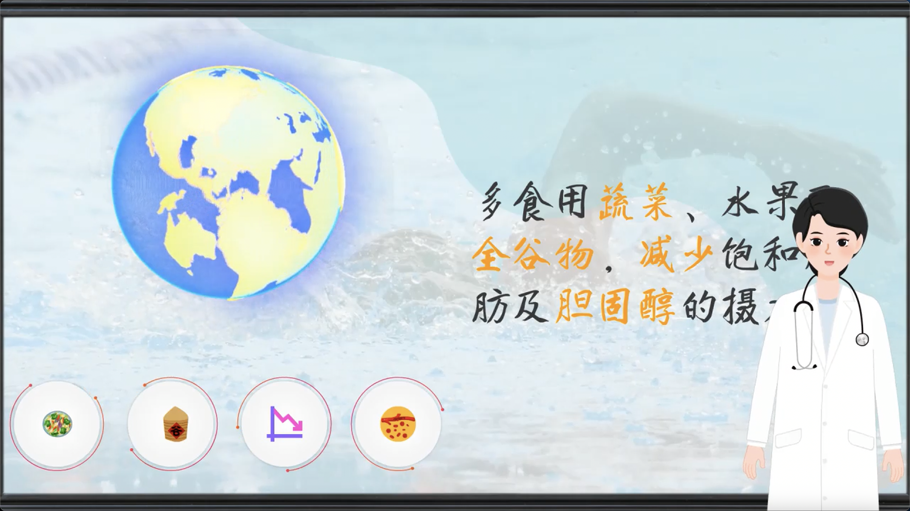
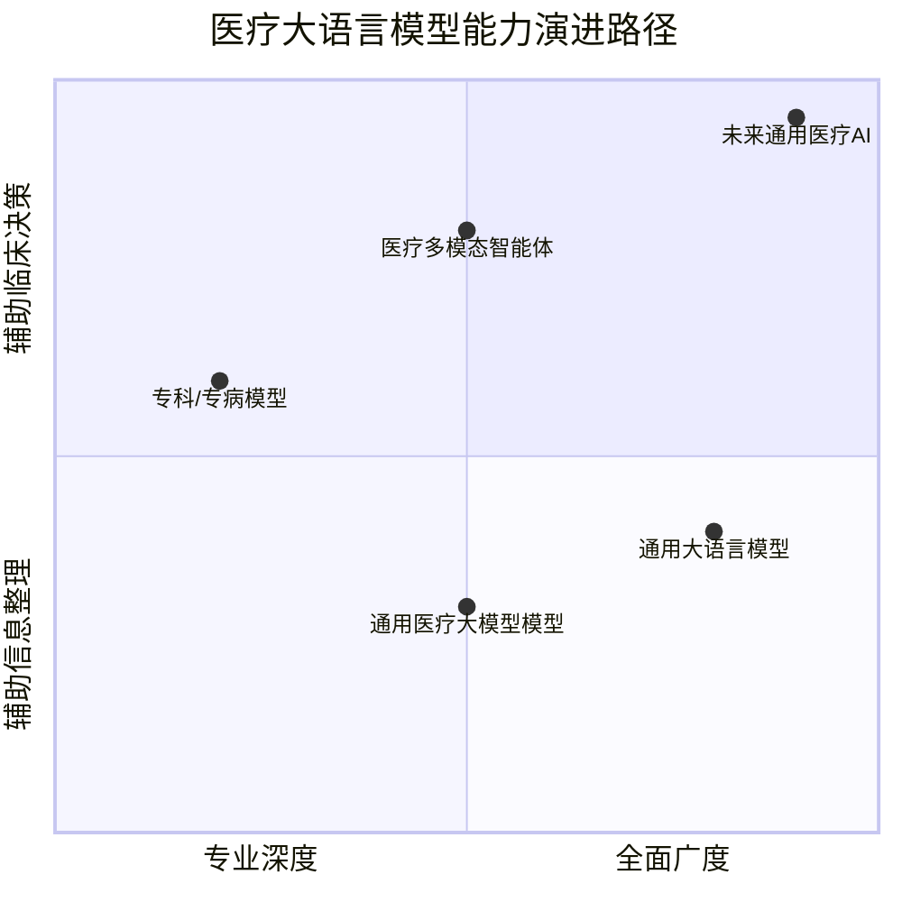

# 终章 医疗大模型临床落地：实例、挑战与发展方向

在前面的章节中，我们看到了通用、医疗、专科专病大语言模型如何像一支训练有素的医疗团队，在不同场景下协同工作，为临床实践提供强大支持。然而，任何一项新技术在真正融入临床工作流之前，我们都必须清醒地认识到它的边界与挑战，并共同探索未来的可能性。

## 5.1 大模型应用医院真实案例

当前，医疗AI已从概念验证逐步走向临床实践。国内多家医疗机构开展了有益尝试，下表概括了部分具有代表性的应用实例：

- **北京协和医院 —— 罕见病 AI 大模型 “协和・太初”**
  - 应用场景：罕见病辅助诊断
  - 实际效果：依托我国多年积累的罕见病知识库与中国人群基因检测数据，帮助医生更精准快速识别罕见病，显著缩短确诊周期
  - 参考链接：<https://www.pumch.cn/lys_details/40037.html>
- **上海交通大学医学院附属第六人民医院 —— 糖尿病多模态大模型 “DeepDR-LLM”**
  - 应用场景：糖尿病视网膜病变（DR）辅助诊断、个性化糖尿病管理、基层诊疗支持
  - 实际效果：融合视觉 - 语言多模态技术，经 37.2 万条基层慢病数据与 50 万张眼底图像训练，有效提升 DR 筛查准确率与基层管理水平，改善患者自我管理行为和转诊依从性
  - 参考链接：<https://news.sjtu.edu.cn/jdzh/20240726/200675.html>
- **瑞金医院、上海交通大学医学院、华为 —— 病理大模型 “RuiPath”**
  - 应用场景：泛癌种病理辅助诊断、多模态病理分析、AI 技术开源
  - 实际效果：基于百万级数字切片库训练，覆盖我国 90% 癌症发病人群的 19 类癌种，单切片诊断提速至秒级；7 项辅助诊断任务达行业领先，开源后大幅降低基层部署门槛（注：该模型于 2025 年 6 月开源，本内容基于公开信息整理）
  - 参考链接：<https://www.huawei.com/cn/news/2025/6/data-storage-RuiPath/>
- **中山大学附属第三医院 —— 智慧医院 “人工智能+” 系列成果**
  - 应用场景：医疗领域智能助手、手术流程管理、患者用药指导、大模型应用开发
  - 实际效果：推出私域GPT、手术非常准、药师叮嘱、元景大模型平台四大应用，提升医疗效率与服务体验，推动医院智慧化建设
  - 参考链接：<https://www.peopleapp.com/column/30047830582-500006015944>
- **四川大学华西医院消化内科 —— 医学 AI 智能体 “睿兵 Agent”**
  - 应用场景：消化领域诊断辅助、疾病管理、科研支持
  - 实际效果：分患者端 “医知 Dr” 与医生端 “论界 Scholar”，可普及健康知识、实现疾病全周期管理，还能辅助文献解读与综述生成（注：该智能体于 2025 年 3 月发布，本内容基于公开信息整理）
  - 参考链接：<https://news.qq.com/rain/a/20250301A072BP00>
- **深圳龙岗人民医院、香港中文大学（深圳）—— 医疗 AI 大模型 “华佗 GPT”**
  - 应用场景：通用医疗咨询、基础诊疗建议辅助
  - 实际效果：经高质量中文医学语料库训练，生成与理解能力突出，在准确性、流畅性上表现优异，可辅助缓解基础诊疗压力
  - 参考链接：<https://news.qq.com/rain/a/20231003A012YZ00>
- **南方医科大学 —— 消化影像筛查辅助诊断**
  - 应用场景：胃镜早癌筛查、辅助诊疗
  - 实际效果：显著提升胃黏膜早癌检出率，其智能影像库与 PACS 系统无缝对接，既方便临床管理又为医学生提供丰富实训素材
  - 参考链接：
    - <https://news.smu.edu.cn/info/1016/109096.htm>
    - <https://www.x-mol.com/groups/aimi_lab/news/78758>

更多案例可以参考相关公司的解决方案：

1. <https://www.sensetime.com/cn/case-index?id=51134437>
1. <https://healthcare.tencent.com/production/5>

## 5.2 如何在医疗场景逐个流程应用 —— 以消化内科为例

消化内科是临床中接诊量较大的科室，从患者 “肚子疼想来检查” 到 “出院后怎么养”，每个流程都有明确需求。下面我们就以**消化内科**为例，拆解 AI 在 “就诊前、诊断、治疗、康复管理” 四个阶段的具体用法，就像给你配了一位 “全程在线的 AI 辅助岗”。

#### 1. 就诊前：提前 “摸清情况”，减少无效沟通

- **核心需求**：患者就诊前常说不清症状（比如 “肚子不舒服” 没说清是胀痛还是绞痛），医生接诊时要花大量时间追问基础信息。
- **可用模型**：HuatuoGPT（医疗通用预问诊模型）、丁香医生、阿里健康等应用内预诊疗模型
- **具体用法**：患者通过医院公众号 / 小程序与 AI 对话，AI 会按 “症状 - 持续时间 - 诱发因素 - 既往病史” 的逻辑引导提问（比如 “腹痛是上腹部还是下腹部？吃了油腻食物后会加重吗？”），最后生成一份 “症状初筛报告”，提前同步到医生的 HIS 系统。你接诊前扫一眼报告，就能知道 “患者 45 岁，上腹痛 3 天，吃辣后加重，有胃溃疡病史”，直接聚焦关键问题。

#### 2. 诊断：多双 “眼睛” 看结果，降低漏诊风险

- **核心需求**：诊断时要结合患者症状、实验室检查（如血常规）、影像（如腹部 CT），信息多且杂，容易忽略细节。
- **可用模型**：
  - DeepDR-LLM（影像辅助解读模型，扩展至腹部影像）：你开了腹部 CT 后，AI 会快速标注可疑区域（比如 “胃窦部黏膜增厚，建议结合内镜进一步检查”），并给出影像初判结论。
  - 华西 - 华为联合内科诊断 LLM（消化专科版）：AI 结合患者的血常规（如白细胞升高）、症状（上腹痛）、影像结果，生成 “诊断支持清单”，列出 3 个可能诊断（如 “1. 急性胃炎；2. 胃溃疡复发；3. 胆囊炎”）及每个诊断的依据，帮你缩小排查范围。

#### 3. 治疗：精准 “查禁忌、找指南”，避免用药风险

- **核心需求**：消化科常用药（如奥美拉唑、阿莫西林）有不少禁忌（比如肝损伤患者要减量），且指南更新快，手动查耗时。
- **可用模型**：
  - 丁香园用药助手 AI 版：你考虑给患者开奥美拉唑时，AI 会自动弹出提醒 ——“患者有乙肝病史（肝酶偏高），建议剂量从 20mg / 日减至 10mg / 日，避免与氯吡格雷同服”。
  - UpToDate AI 临床顾问：你想确认 “幽门螺杆菌阳性的胃炎怎么治”，AI 直接提取最新指南核心内容（如 “推荐铋剂四联疗法，疗程 14 天”），不用你手动翻指南文档。
  - 协和内科治疗 LLM：根据诊断结果，AI 生成 “治疗方案初稿”，包含用药名称、剂量、疗程（如 “阿莫西林 1g / 次，2 次 / 日，连服 14 天”）、复查时间（如 “2 周后查肝肾功能，4 周后复查幽门螺杆菌”），你只需根据患者实际情况微调。

4. 康复管理：持续 “盯恢复、答疑问”，减轻随访压力

- **核心需求**：患者出院后常问 “能不能吃辣”“忘了怎么吃药”，反复咨询占用医生大量时间；且康复情况反馈不及时，可能影响恢复。
- **可用模型**：
  - 通义千问（qwen，通用医疗版）：患者通过医院 APP 问 “服药期间能喝牛奶吗”，AI 会结合其 “胃溃疡恢复期” 的情况回答 ——“可以喝温牛奶，避免冰牛奶刺激胃黏膜，但每天不超过 200ml”。
  - 消化内科康复管理 AI（如浙一消化科康复助手）：AI 自动生成 “个性化康复计划”，包含饮食清单（推荐小米粥、蒸蛋，避免咖啡、火锅）、运动建议（饭后散步 15 分钟，避免弯腰劳作），并每周提醒患者提交恢复情况（如 “本周是否有腹痛”），异常情况会及时推送给你。

*图：医疗 AI 临床应用流程图*

## **5.3 当前局限与挑战：AI助手的“能力边界”在哪里？**

*图：AI辅助决策的闭环流程。核心在于医生的评估与最终决策权。*

尽管AI展现出巨大潜力，但将其融入临床工作流前，我们必须清醒地认识其边界与挑战：**可解释性、可靠性、实用性与角色边界**。具体讨论如下：

### 5.3.1 可解释性（Explainability）——“黑箱”决策与医生的临床思维

- **核心问题**：AI能给出“是什么”的答案，但很难清晰地解释“为什么”。

- **医生视角**：这就像一位实习医生报告：“根据指南，患者应使用A药。”但当您追问“为什么不是B药？A药与患者现有肝肾功能的剂量关系是什么？”时，他可能只能复述文献，而无法进行真正的病理生理推导。

- **真实案例**：一个皮肤病AI模型将一张罕见皮疹图片分类为“湿疹”，置信度高达95%。但资深皮肤科医生通过皮肤镜观察，发现了一个被AI忽略的细微特征，最终确诊为早期蕈样肉芽肿。AI无法像人类专家一样，将其决策过程追溯到具体的图像特征和病理逻辑链。

- **对策**：永远将AI的结论视为“高级辅助证据”而非“诊断金标准”。医生的价值在于整合AI的输出、患者的实际体征、实验室数据和个人经验，形成最终可解释、可追溯的临床决策。

### 5.3.2 可靠性（Reliability）如何识别AI的“信口开河”？

- **核心问题**：AI可能会生成看似合理但完全错误的信息，即“幻觉”。

- **医生视角**：这位“实习医生”有时为了给出一个答案，可能会编造不存在的文献引用，甚至杜撰临床表现。例如，在汇报一个罕见病时，他可能会 confidently 地声称“该病在《新英格兰医学杂志》某期有报道”，但经查证，该文章并不存在。

- **真实案例**：在生成一份疑难病例讨论报告时，AI引用了一篇关键文献来支持其论点。但医生核查时发现，该文献的作者、期刊和发表年份都是捏造的。

- **对策**：建立“事实核查”机制。对于AI提供的任何关键信息（特别是引用、数据、剂量），都必须通过权威数据库（如UpToDate, PubMed）或医院信息系统进行二次确认。信任，但必须验证。

### 5.3.3 实用性（Practicality）--是“得力助手”还是“额外负担”？

- **核心问题**：AI工具是否无缝嵌入现有临床工作流程，是决定其能否被广泛采纳的关键。

- **医生视角**：一个需要您在不同系统间反复复制粘贴、生成结果格式与医院HIS系统不兼容的AI，即使再准确，也会因为操作繁琐而被弃用。理想的AI应该像“手术台上的第二助手”，主动递上您需要的器械，而不是让您停下手术去找它。

- **对策**：在引入AI工具前，评估其集成度。未来的方向是AI与电子病历系统深度整合，能够自动抓取患者信息，并将生成的病历、摘要直接填入对应模块，真正为医生“减负”。

### 5.3.4 **角色边界（Role Boundary）——AI是“工具”，医生是“决策者”**

- **核心问题**：必须明确，AI在任何情况下都不应承担医疗决策的法律和道德主体责任。
- **医生视角**：AI如同最先进的影像学设备（如PET-CT），它能提供前所未有的洞察，但最终的影像判读、病情评估和治疗方案制定，必须由具备执业资格的医生来完成。**AI是听诊器的进化，而非医生的替代。**
- **对策**：在临床实践中，始终保持决策的主导权。利用AI拓展认知边界、提高效率，但最终的处方权和对患者的责任，必须牢牢掌握在医生手中。

## **5.4 未来方向：我们的AI助手还能做什么？**

技术的演进正描绘着一幅激动人心的未来图景。AI将不仅是工具，更可能成为医生在教育、沟通和诊疗全流程中的合作伙伴。

### 5.4.1 **生成科普视频：生成个性化科普视频** => FreedomAI组内项目

以根据患者的具体情况，生成高度个性化的图文或视频科普材料。例如，对一位刚确诊的糖尿病患者，AI能自动生成一份易于理解的疾病介绍、饮食建议和运动指导，并可用方言进行语音讲解，极大提升患者的理解与依从性。目前国内外出名的AI生成视频平台如下：

| **服务应用**                   | **网址**                                                    | **需求特点**                                                 |
| :----------------------------- | :---------------------------------------------------------- | :----------------------------------------------------------- |
| **Sora (OpenAI)**              | <https://openai.com/sora>                                   | 能够生成高精度、物理效果逼真的短视频，适合医学动画、手术预演等复杂场景。 |
| **Google Veo**                 | <https://deepmind.google/technologies/veo/>                 | 生成具有电影质感的视频，并提供丰富的精细编辑与控制功能。     |
| **Comfy**                      | <https://www.comfy.org/>                                    | 基于节点式架构的 Stable Diffusion 图形界面，自定义程度高且支持音视频生成，还能通过插件降门槛，核心适配医疗高精度影像分析、手术模拟等场景，可规模化生产医疗教育内容。 |
| **Odyssey**                    | <https://odyssey.ml/introducing-odyssey-2>                    | 生成可互动的视频，用户不仅可以用方向键在AI生成的场景中行走，还能输入提示词实时操控视频内容。这意味着AI视频不再是单向的"播放”，而是变成了可交互、可探索的动态世界 |
| **Synthesia**                  | [https://www.synthesia.io](https://www.synthesia.io/)       | 快速生成多语言虚拟人讲解视频，具备企业级合规性，适合标准化跨国医疗内容输出。 |
| **Pictory**                    | [https://pictory.ai](https://pictory.ai/)                   | 擅长将长视频智能压缩为精华片段，并支持数据可视化，适合制作医学会议纪要与论文摘要。 |
| **通义万相 AI 生视频（阿里）** | <https://wan.video/> <https://github.com/Wan-Video>    | 对中文语义理解精准，支持文本、图片多模态生成视频，适配医疗基础科普、病例流程可视化等场景，操作门槛低且生成效率高。 |
| **即梦AI (剪映)**              | [https://jimeng.jianying.com](https://jimeng.jianying.com/) | 对中文语义优化良好，生成内容物理模拟效果逼真，适合制作中文医学科普与康复指导视频。 |
| **可灵AI (快手)**              | <https://app.klingai.com/cn/>                               | 移动端友好，生成内容拟人化、亲和力强，适合在短视频平台传播急救知识等科普内容。 |
| **讯飞智作**                   | <https://peiyin.xunfei.cn/>                                 | 依托自有语音技术，提供专业度高、配音自然的虚拟人口播视频，适合批量生产健康讲座。 |
| **海螺AI**                     | [https://hailuoai.com](https://hailuoai.com/)               | 可生成高精度实验演示视频，如细胞分裂等微观场景，并提供社区支持供创作者交流灵感。 |

以下是我们生成的简单[参考案例：高血压科普](./media/chap5/AIGCHypertensionVod.mp4)演示

*图：AI生成医疗相关科普视频案例。*

### 5.4.2 **模拟患者：永不疲倦的“标准化病人”提供问诊训练** => FreedomAI组内项目

对于医学生和年轻医生，AI可以扮演“永不疲倦”的模拟患者。它可以模拟各种性格、文化背景、甚至是不配合的患者，根据预设的病情给出合理回应，并对学生的问诊逻辑、沟通技巧进行实时评估和反馈，为培养下一代优秀医生提供强大支持。

- **练习沟通**：面对一个焦虑、不停提问的“模拟家属”，住院医师如何安抚？
- **锻炼思维**：一个主诉“腹痛”的虚拟患者，会根据医生的问诊和检查顺序，动态地呈现不同的体征，考验医生的临床思维广度与深度。

### 5.4.3 **走向通用医疗AI（GMAI）**

未来的方向是构建一个融合文本、影像、基因组学等多维度信息的**通用医疗AI**。医生将真正从信息过载中解脱，角色进化为 **“最终决策的制定者”** 和 **“人性化关怀的提供者”**。

想象一下，面对一位复杂病例，通用医疗AI可以在短时间内：

1. 解读最新的影像学和基因组学数据；
2. 检索全球最新临床试验和文献；
3. 结合本院资源和患者情况；
4. 生成几项结构化的、利弊分析详尽的个性化治疗备选方案。

*图：医疗AI从当前的文本辅助，逐步迈向多模态交互，最终走向通用医疗AI的演进路径。*

## 5.5 结语

技术是工具，而医生是灵魂。我们探索和应用AI，不是为了取代医生的智慧与仁心，而是为了将医生从繁重的重复性劳动中解放出来，让他们能将更多宝贵的时间和精力，投入到与患者的深度沟通、复杂病例的研判以及医学人文关怀之中。正视局限，拥抱未来，让我们携手，共同塑造一个更高效、更精准、更有温度的智慧医疗新时代

从通用到专病，我们看到了一条AI在医疗领域不断深化、精准化的路径。然而，技术越是强大，我们越需要保持医学的人文内核和批判性思维。未来的卓越医生，必然是那些最善于与AI协同共舞的专家。他们深知AI的边界，也精通如何激发其潜力，最终将技术的温度，传递给每一位患者。
