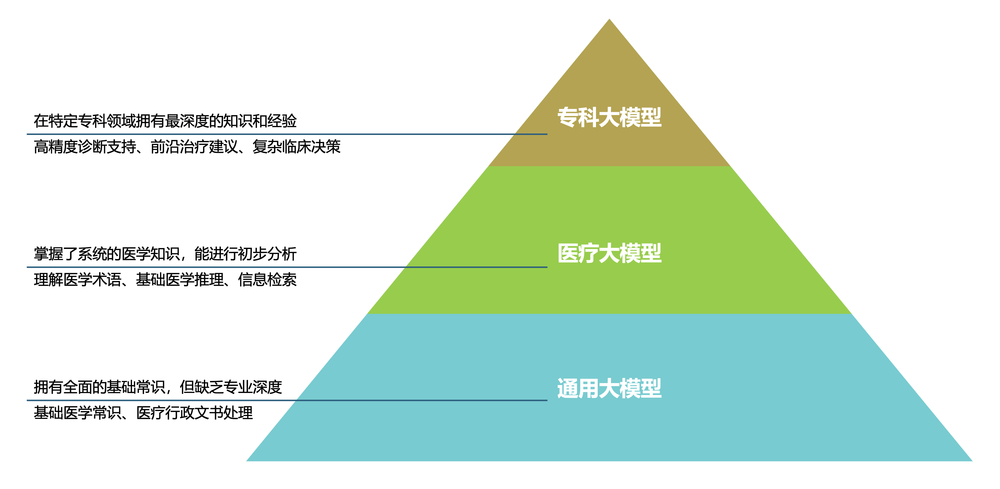
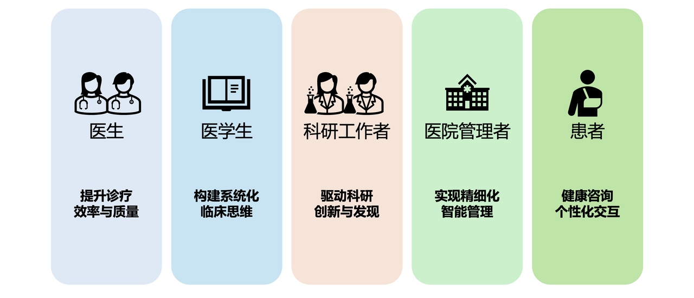

# Happy Medical AI

**以大语言模型为框架，以医疗场景为引入，从实践案例到技术讲解。**

本项目通过“场景驱动 + 技术解析”的方式，帮助医学学习者和实践者理解并掌握 AI 在医疗中的落地应用。

## 🌟 项目逻辑

1. **从实践案例出发**：真实医疗场景（如病例分析、临床决策、随访管理）
2. **场景映射模型层级**：**对应通用 → 医疗 → 专科 → 专病大语言模型**
3. **深入技术讲解**：由实际场景问题引发的技术需求入手，详细简介实用性高、学习效益显著的应用技术与对应场景
4. **形成整体框架**：构建从“临床应用”到“AI 技术”的系统化路径

## 📂 项目面向对象

## 📂 配套资源

- **实际案例**：临床脱敏病历 / 影像 / 随访数据
- **训练案例**：可复现的输入输出模板）
- **讲解视频**：每场景 10-15 分钟操作演示 （TODO）
- **应用反馈**：来自医生、医学生、医学科研人员、医院管理工作者、患者等用户的使用心得和改进意见

## 📖 项目导航索引

| 章节                                                         | 关键内容                                                     | 状态 |
| ------------------------------------------------------------ | ------------------------------------------------------------ | ---- |
| [第一章 AI赋能医疗：应用概览与模型区分](./chap1.md)          | 介绍AI在影像分析、智能问诊等医疗场景的具体应用，对比通用、医疗、专科三类大模型的“本领”与适用场景，搭建知识框架 | ✅    |
| [第二章 通用大模型的医疗普适性：提示词工程实践](./chap2.md)  | 结合骨科手术、糖尿病管理等真实场景，讲解如何用提示词工程引导通用大模型辅助医疗工作，让“通用智能”更好服务临床 | ✅    |
| [第三章 通用医疗大模型：全能医疗助手的功能与实践](./chap3.md) | 解析HuatuoGPT等“全科助手”模型，说明其在慢性病管理、智能分诊、医疗知识问答等方面的作用，介绍双轨训练等核心技术，以及医院落地案例 | ✅    |
| [第四章 专科医疗大模型：专科诊疗的智能辅助](./chap4.md)      | 聚焦“专科副手”模型，如XrayGPT（胸片分析）、OncoGPT（肿瘤诊疗）等，讲解其在放射科、肿瘤科等专科的具体应用，以及视觉-语言对齐等关键技术 | ✅    |
| [终章 医疗大模型临床落地：案例、挑战与未来](./chap5.md)      | 分享国内医院的真实应用案例，拆解大模型临床实践全流程，分析可解释性、可靠性等现存问题，展望未来发展方向 | ✅    |

## 🚀 学习方式

1. 从 **案例** 入手 → 先看真实场景
2. 对照 **模型分类** → 找到合适的模型类型
3. 进入 **技术讲解** → 学习 Prompt/调用/微调方法
4. 完成 **实操训练** → 在临床或科研中应用
5. 分享 **反馈与优化** → 与社区共建

## 🤝 贡献方式

欢迎提交：

- 新的医疗场景案例与训练数据
- 不同类型大语言模型的应用经验
- 教程改进与工具优化

## 📜 License

本项目适用于 **医学学习与科研**，不替代临床诊断与治疗。

遵循 CC BY-NC-SA 4.0 协议。
